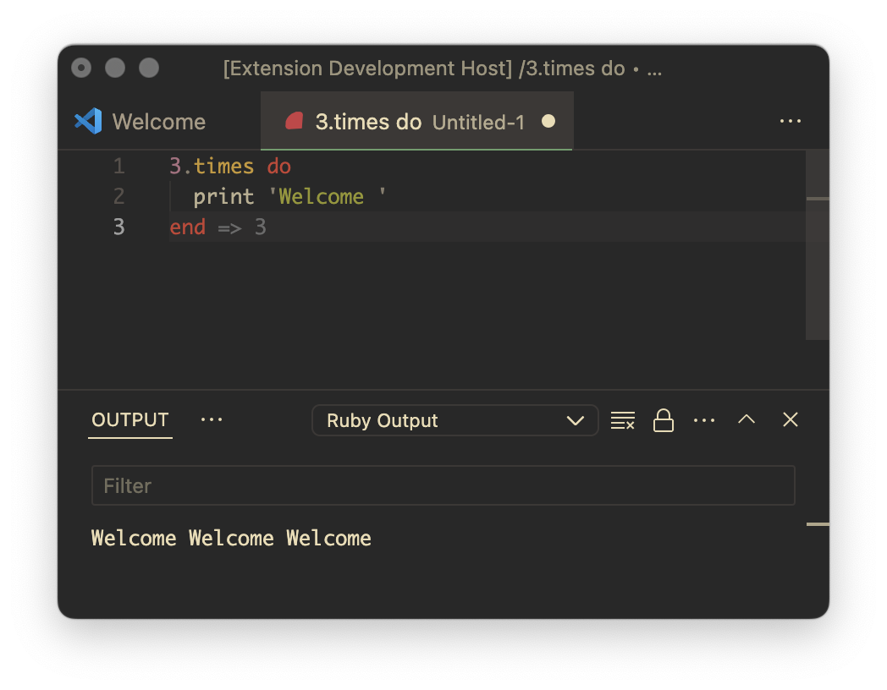

# Ruby Eval

Web extension (works in vscode.dev and github.dev) to evaluate ruby scripts.

## Features

- Evaluates top level statements
- Works in browser (I created it for iPad)
- Supports stdout

## Requirements

Node.js, npm, yarn should be installed. Run `yarn` to install dependencies.

## Extension Settings

Include if your extension adds any VS Code settings through the `contributes.configuration` extension point.

For example:

This extension contributes the following settings:

* `myExtension.enable`: Enable/disable this extension.
* `myExtension.thing`: Set to `blah` to do something.
