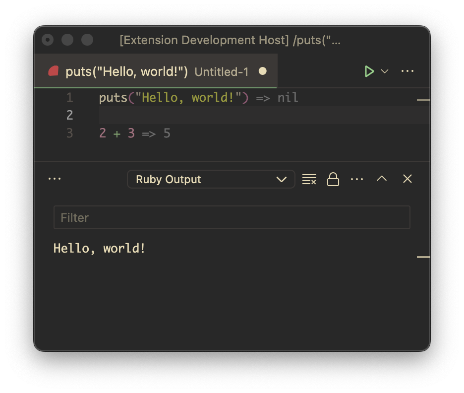

# Ruby Eval

Web extension (works in VS Code, vscode.dev and github.dev) to evaluate ruby scripts.

## Features

- Evaluates top level statements
- Based on [ruby.wasm](https://github.com/ruby/ruby.wasm)
- Works in browser (Ruby 3.4 does not work in Safari)
- Supports stdout/stdin

## Technologies used

It runs code inside your VSCode instance worker. Leverages [ruby-prism][1]
to parse source code and [ruby-wasm][2] to create Ruby VMs and evaluate the code.

## Extension Settings

This extension contributes the following settings:

* `ruby-eval.rubyVersion`: Sets Ruby version (3.2 or newer)

[1]: https://github.com/ruby/prism
[2]: https://github.com/ruby/ruby.wasm
